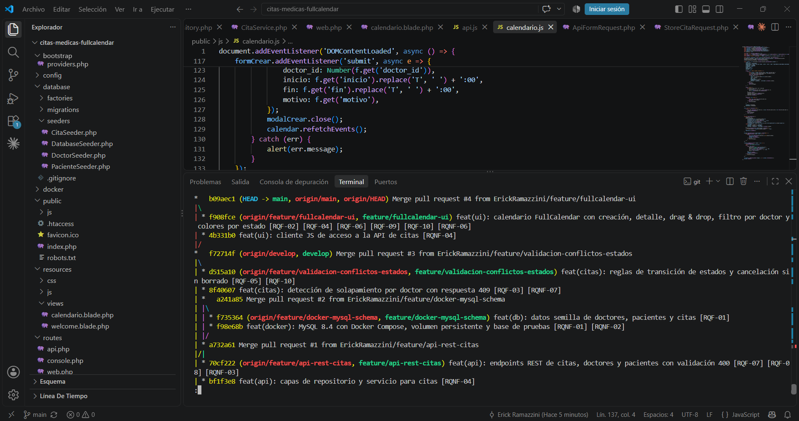
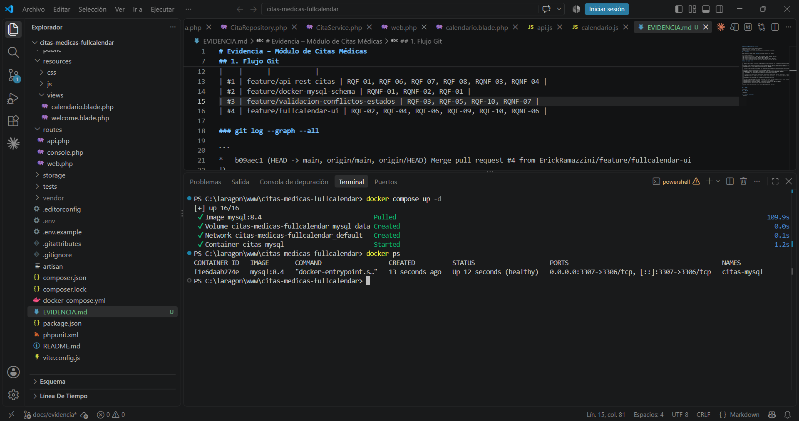
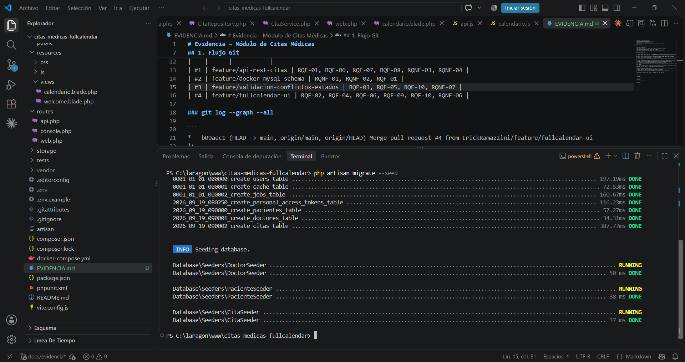
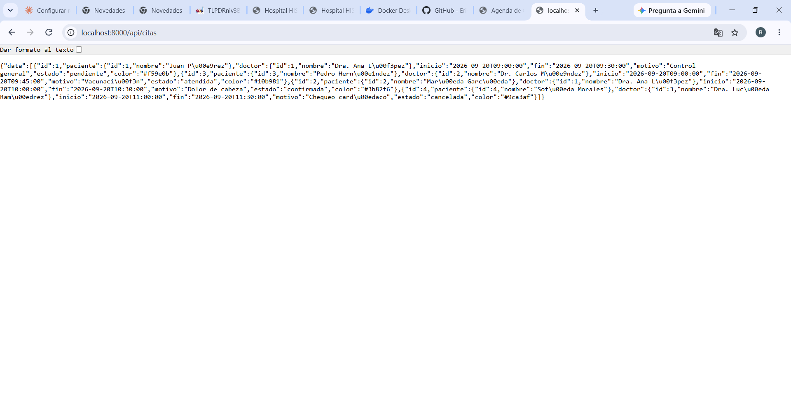

# Evidencia – Módulo de Citas Médicas

**Estudiante:** Erick Rolando Ramazzini Muralles
**Curso:** Análisis de Sistemas II – 2026
**Repositorio:** https://github.com/ErickRamazzini/citas-medicas-fullcalendar

**Stack:** Laravel 12 · MySQL 8.4 en Docker · FullCalendar 6

---

## 1. Flujo Git

Se trabajó con Git Flow: ramas de feature creadas desde `develop`/`main` y fusionadas mediante Pull Request con merge commit.

| PR | Rama | Destino | Requisitos |
|----|------|---------|-----------|
| #1 | feature/api-rest-citas | develop | RQF-01, RQF-06, RQF-07, RQF-08, RQNF-03, RQNF-04 |
| #2 | feature/docker-mysql-schema | develop | RQNF-01, RQNF-02, RQF-01 |
| #3 | feature/validacion-conflictos-estados | develop | RQF-03, RQF-05, RQF-10, RQNF-07 |
| #4 | feature/fullcalendar-ui | main | RQF-02, RQF-04, RQF-06, RQF-09, RQF-10, RQNF-06 |
| #5 | fix/cita-resource | main | RQF-07, RQNF-03 |

Convención de commits: Conventional Commits (`feat`, `fix`, `chore`, `docs`) con referencia al ID del backlog en cada mensaje.

### git log --graph --all

```
*   85375dc (HEAD -> docs/evidencia, origin/main, origin/HEAD, main) Merge pull request #5 from ErickRamazzini/fix/cita-resource
|\  
| * e5806a5 (origin/fix/cita-resource, fix/cita-resource) fix(api): agregar CitaResource faltante para serializar citas [RQF-07] [RQNF-03]
|/  
*   b09aec1 Merge pull request #4 from ErickRamazzini/feature/fullcalendar-ui
|\  
| * f908fce (origin/feature/fullcalendar-ui, feature/fullcalendar-ui) feat(ui): calendario FullCalendar con creaci├│n, detalle, drag & drop, filtro por doctor y colores por estado [RQF-02] [RQF-04] [RQF-06] [RQF-09] [RQF-10] [RQNF-06]
| * 4b331b0 feat(ui): cliente JS de acceso a la API de citas [RQNF-04]
|/  
*   f72714f (origin/develop, develop) Merge pull request #3 from ErickRamazzini/feature/validacion-conflictos-estados
|\  
| * d515a10 (origin/feature/validacion-conflictos-estados, feature/validacion-conflictos-estados) feat(citas): reglas de transici├│n de estados y cancelaci├│n sin borrado [RQF-05] [RQF-10]
| * 8f40607 feat(citas): detecci├│n de solapamiento por doctor con respuesta 409 [RQF-03] [RQNF-07]
| *   a241a85 Merge pull request #2 from ErickRamazzini/feature/docker-mysql-schema
| |\  
| | * f735364 (origin/feature/docker-mysql-schema, feature/docker-mysql-schema) feat(db): datos semilla de doctores, pacientes y citas [RQF-01]
| | * f98e68b feat(docker): MySQL 8.4 con Docker Compose, volumen persistente y base de pruebas [RQNF-01] [RQNF-02]
| |/  
| * a732a61 Merge pull request #1 from ErickRamazzini/feature/api-rest-citas
|/| 
| * 70cf222 (origin/feature/api-rest-citas, feature/api-rest-citas) feat(api): endpoints REST de citas, doctores y pacientes con validaci├│n 400 [RQF-07] [RQF-08] [RQNF-03]
| * bf1f3e8 feat(api): capas de repositorio y servicio para citas [RQNF-04]
| * 1b221fb feat(db): migraciones y modelos de pacientes, doctores y citas [RQF-01] [RQF-07]
| * 389a9f9 feat(api): habilitar rutas API con install:api [RQF-07]
|/  
* 23414a8 chore: scaffold inicial Laravel 12 configurado para MySQL [RQNF-01]
```



---

## 2. Docker (RQNF-01, RQNF-02)

MySQL se ejecuta exclusivamente en Docker, con persistencia mediante el volumen `mysql_data`. El puerto del host es 3307 para no chocar con instalaciones locales. La aplicación no usa SQLite: `DB_CONNECTION=mysql` en `.env.example`, `config/database.php` y `phpunit.xml`.

### Comando

```
docker compose up -d
```

### Salida

```
[+] up 16/16
 ✔ Image mysql:8.4                                  Pulled
 ✔ Volume citas-medicas-fullcalendar_mysql_data     Created
 ✔ Network citas-medicas-fullcalendar_default       Created
 ✔ Container citas-mysql                            Started
```

### docker ps

```
CONTAINER ID   IMAGE       COMMAND                  CREATED          STATUS                    PORTS                                         NAMES
f1e6daab274e   mysql:8.4   "docker-entrypoint.s…"   13 seconds ago   Up 12 seconds (healthy)   0.0.0.0:3307->3306/tcp, [::]:3307->3306/tcp   citas-mysql
```



---

## 3. Esquema y datos semilla

### Comando

```
php artisan migrate --seed
```

### Salida

```
0001_01_01_000000_create_users_table ........................ 197.19ms DONE
0001_01_01_000001_create_cache_table ......................... 72.53ms DONE
0001_01_01_000002_create_jobs_table ......................... 160.67ms DONE
2026_09_19_080250_create_personal_access_tokens_table ....... 116.23ms DONE
2026_09_19_090000_create_pacientes_table ..................... 57.27ms DONE
2026_09_19_090001_create_doctores_table ...................... 34.31ms DONE
2026_09_19_090002_create_citas_table ........................ 387.77ms DONE

INFO  Seeding database.

Database\Seeders\DoctorSeeder ................................... 50 ms DONE
Database\Seeders\PacienteSeeder ................................. 38 ms DONE
Database\Seeders\CitaSeeder ..................................... 37 ms DONE
```

Datos semilla: 3 doctores, 4 pacientes y 4 citas (una por cada estado).



---

## 4. API REST (RQF-07, RQNF-03)

Arquitectura por capas (RQNF-04): `Controller → FormRequest → Service → Repository → Model`.

| Método | Ruta | Propósito | Códigos |
|--------|------|-----------|---------|
| GET | /api/citas | Listar con filtros `doctor_id`, `paciente_id`, `desde`, `hasta` | 200 |
| POST | /api/citas | Crear cita | 201, 400, 409 |
| GET | /api/citas/{id} | Detalle | 200, 404 |
| PUT | /api/citas/{id} | Reprogramar | 200, 400, 404, 409 |
| PATCH | /api/citas/{id}/estado | Cambiar estado | 200, 400, 404 |
| GET | /api/doctores | Listar doctores | 200 |
| GET | /api/pacientes | Listar pacientes | 200 |

### GET /api/citas → 200

```json
{
  "data": [
    {
      "id": 1,
      "paciente": { "id": 1, "nombre": "Juan Pérez" },
      "doctor": { "id": 1, "nombre": "Dra. Ana López" },
      "inicio": "2026-09-20T09:00:00",
      "fin": "2026-09-20T09:30:00",
      "motivo": "Control general",
      "estado": "pendiente",
      "color": "#f59e0b"
    },
    {
      "id": 3,
      "paciente": { "id": 3, "nombre": "Pedro Hernández" },
      "doctor": { "id": 2, "nombre": "Dr. Carlos Méndez" },
      "inicio": "2026-09-20T09:00:00",
      "fin": "2026-09-20T09:45:00",
      "motivo": "Vacunación",
      "estado": "atendida",
      "color": "#10b981"
    },
    {
      "id": 2,
      "paciente": { "id": 2, "nombre": "María García" },
      "doctor": { "id": 1, "nombre": "Dra. Ana López" },
      "inicio": "2026-09-20T10:00:00",
      "fin": "2026-09-20T10:30:00",
      "motivo": "Dolor de cabeza",
      "estado": "confirmada",
      "color": "#3b82f6"
    },
    {
      "id": 4,
      "paciente": { "id": 4, "nombre": "Sofía Morales" },
      "doctor": { "id": 3, "nombre": "Dra. Lucía Ramírez" },
      "inicio": "2026-09-20T11:00:00",
      "fin": "2026-09-20T11:30:00",
      "motivo": "Chequeo cardíaco",
      "estado": "cancelada",
      "color": "#9ca3af"
    }
  ]
}
```



### Validación en el servidor (RQF-03, RQNF-07)

La detección de doble reserva se ejecuta en `CitaService::validarDisponibilidad()`, apoyada en `CitaRepository::existeSolapamiento()`. Considera activas solo las citas `pendiente` y `confirmada` del mismo doctor cuyo horario se solapa (`inicio < fin_nuevo` y `fin > inicio_nuevo`). Si hay conflicto responde **409**. Aplica tanto al crear como al reprogramar.